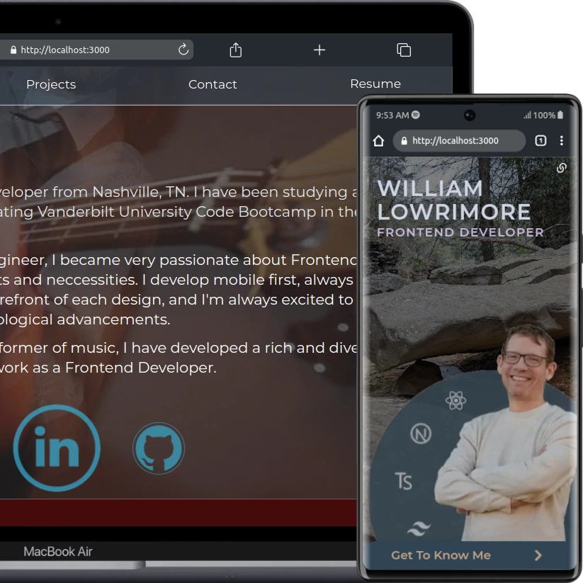

 

# William Lowrimore

## React Frontend Developer

William Lowrimore is a frontend developer from Nashville, TN. A former instructor, performer, and composer of music, he moved to Nashville to persue his career in software engineering, graduating Vanderbilt University Code Bootcamp in the Spring of 2022 as a Certified Web Developer. In the fall of 2022 he earned the role of Junior Software Engineer with the highly touted Software Engineering firm, Coroutine. He now works as a freelance React/Next.JS Frontend Developer, and continues to study and further his knowledge of the latest technological advancements across the web development spectrum.

### Technologies Used:

- HTML5
- TailwindCSS
- Typescript
- React
- Next.JS
- Primitive & Custom React Hooks
- JSON
- React Icons
- React Awesome Reveal
- Cloudinary
- Email.JS

### Contact

- [wlowrimore@gmail.com](mailto://wlowrimore@gmail.com)
- [linkedin/william-lowrimore-dev](https://www.linkedin.com/in/william-lowrimore-dev)
- [www.williamlowrimore.com](https://www.williamlowrimore.com)
- [github/wlowrimore](https://www.github.com/wlowrimore)

&copy; Copyright 2024. All Rights Reserved. William Lowrimore | FakeNameDev &#8482;
